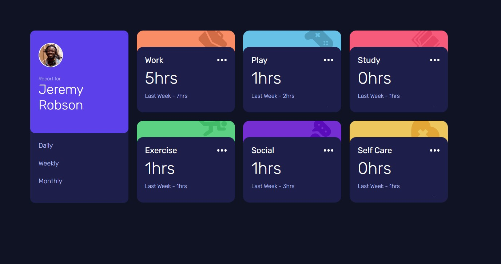
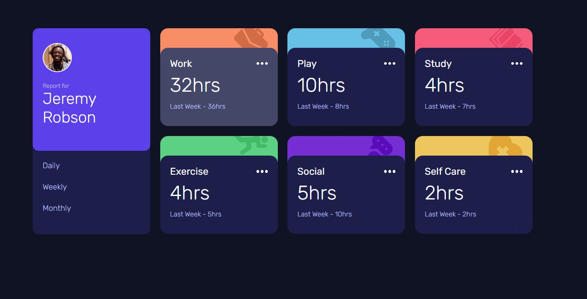
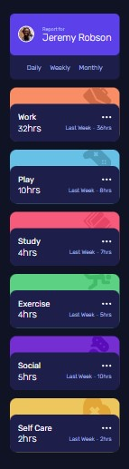

# Frontend Mentor - Time tracking dashboard solution

This is a solution to the [Time tracking dashboard challenge on Frontend Mentor](https://www.frontendmentor.io/challenges/time-tracking-dashboard-UIQ7167Jw).
## Table of contents

- [Overview](#overview)
  - [The challenge](#the-challenge)
  - [Screenshot](#screenshot)
  - [Links](#links)
- [My process](#my-process)
  - [Built with](#built-with)
  - [What I learned](#what-i-learned)
  - [Continued development](#continued-development)
- [Author](#author)
- [Acknowledgments](#acknowledgments)

## Overview

### The challenge

Users should be able to:

- View the optimal layout for the site depending on their device's screen size
- See hover states for all interactive elements on the page
- Switch between viewing Daily, Weekly, and Monthly stats

### Screenshot

### Links

- Solution URL: (https://github.com/JMujuru/Time-tracking-dashboard.github.io)
- Live Site URL: (https://jmujuru.github.io/Time-tracking-dashboard.github.io/)

## My process

I built the HTML 1st but only built the Jemery card as well as one ''work card'' to start. Once I got the HTML in place for that and the CSS for them I moved on to the rest of the HTML as I copied and pasted from the ''work card'' saving me time and formatted it for the other cards. I mapped out the IDs and Class elements that I would use in the Js file. After I completed the HTML I moved on to the CSS for the rest of the project and completed that. After I swiftly moved on to the JS file which was simpler than I thought it would but since already worked with an API in my previous project it made it easier for me to work with that JSON file and how to access it. 
### Built with

- Semantic HTML5 markup
- CSS
- Flexbox
- CSS Grid
- Mobile-first workflow
- JavaScript with JSON
### What I learned

Working with JSON files to fetch and use data, using for loops to get element nodes so that I can get the information from the JSON file.

### Continued development

I'm going to continue working with JSON data and improving my CSS Grid skillset.

## Author

- Frontend Mentor - [@JMujuru](https://www.frontendmentor.io/profile/JMujuru)
## Acknowledgments

- https://www.youtube.com/watch?v=EiNiSFIPIQE&list=PLCWbaYFXPB_LQLRhnnZqXwCepGxSsYay6&index=2&t=6s

With help on understanding Grids better. 
